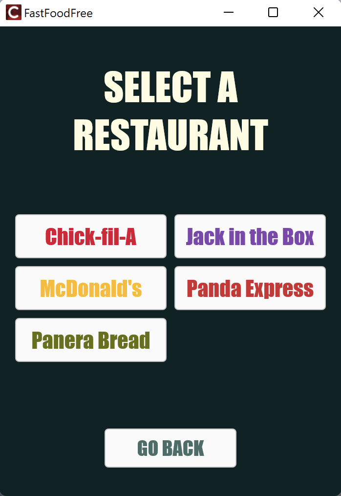
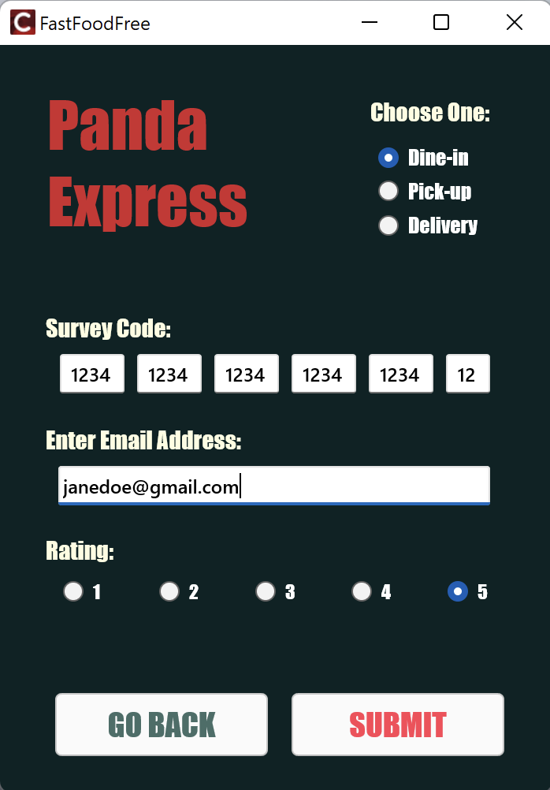
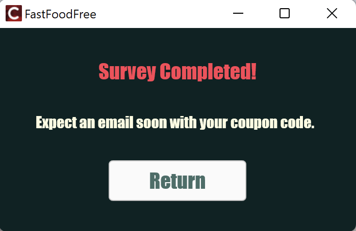

## FastFoodFree - Fast Food Survey Automator

FastFoodFree is an innovative Windows application designed to streamline the survey process for fast food restaurants. With our user-friendly interface and efficient automation, users can complete surveys in seconds and receive incentives effortlessly. No more tedious forms or time-consuming questionnaires.

<p align="center">
    
    
</p>

<p align="center">
    
    
</p>

### Built With

1. C++
2. Python
3. Google Cloud Functions
4. Google Cloud Run

## Getting Started

### Installation

1. Clone the Repository or Download as ZIP:
   
   * Clone the repository using the following command:
   ```sh
   git clone https://github.com/kdluong/FastFoodFree.git
   ```
   * Alternatively, download the repository as a ZIP file by clicking on the "Code" button and selecting "Download ZIP".
     
2. Navigate to the Executable:
   
   * Once the repository is cloned or the ZIP file is extracted, navigate to the following directory:
   ```sh
   src -> gui -> Win32 -> Debug
   ```
   
3. Run the Executable:
   
    * In the "Debug" directory, you will find the FastFoodFree.exe executable file.
    * Double-click on FastFoodFree.exe to run the application.
      
5. Enjoy Fast Food Free!
   
    * Once the application is launched, you can begin using FastFoodFree to redeem your survey incentives in seconds!
   
## Contributing

If you have a suggestion that would make this better, please fork the repo and create a pull request. You can also simply open an issue with the tag "enhancement". Don't forget to give the project a star! Thanks again!

1. Fork the Project
2. Create your Feature Branch (`git checkout -b feature/AmazingFeature`)
3. Commit your Changes (`git commit -m 'Add some AmazingFeature'`)
4. Push to the Branch (`git push origin feature/AmazingFeature`)
5. Open a Pull Request
